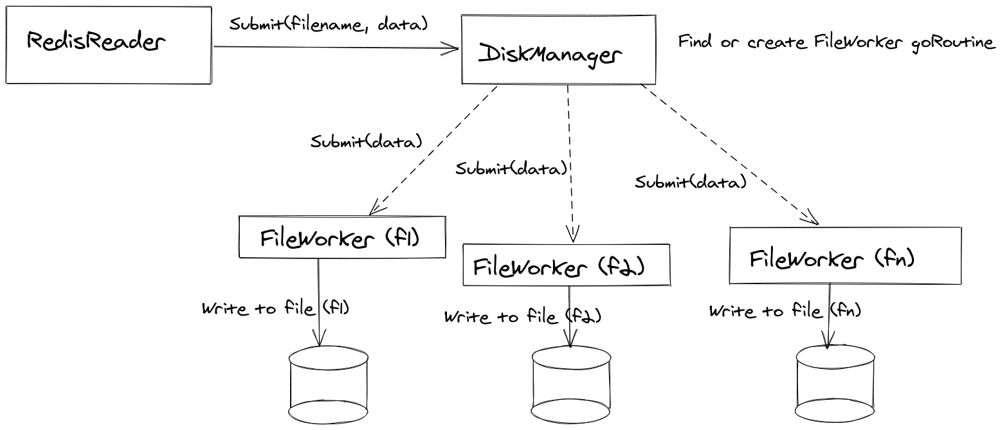

# orderbook-serializer

## Configuration file

```toml

# Streams is an array representing redis streams from which data will be read
streams = [
  "bitfinix",
  "coinbase"
]


# Redis specific configuration, required to establish a connection

[redis]
    redis_host = "localhost:6379"
    redis_password = ""

```

## Architecture



- **RedisReader** reads from redis streams via consumer group and then uses instance of disk manager to submit key (filename) and actual bytes of data.

- **Diskmanager** manages disk operation by submitting data to **Fileworkers**, for each file it spawns a **Fileworker** in a goroutines which write the data concurrently to the disk.
  
- **Fileworker** writes to the disk, via buffered writing scheme for maximum throughput. It also holds a timer. That is if not data has arrived in X time it flushes data, de-registers itself from **diskmanager** until it is created again if required.

## Serialization

Current implementation creates a file with same as that of stream and writes data to it, plan is to refactor it to write it to files based on message in the stream.

## Building

Make sure you have go installed (1.14 and above preferred)

### Download the dependencies
`go mod download`

### Build the executable
`go build .`

### Execute
`./orderbook-serializer -config=<path to toml config>`


